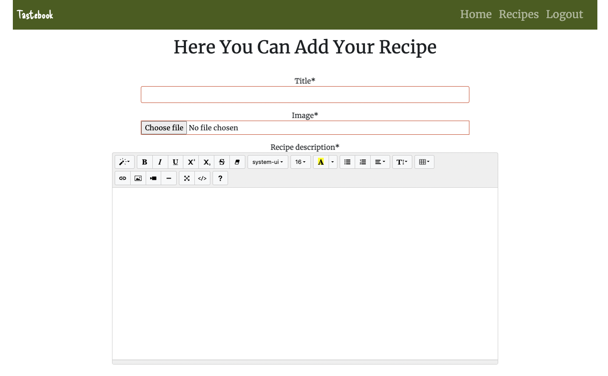
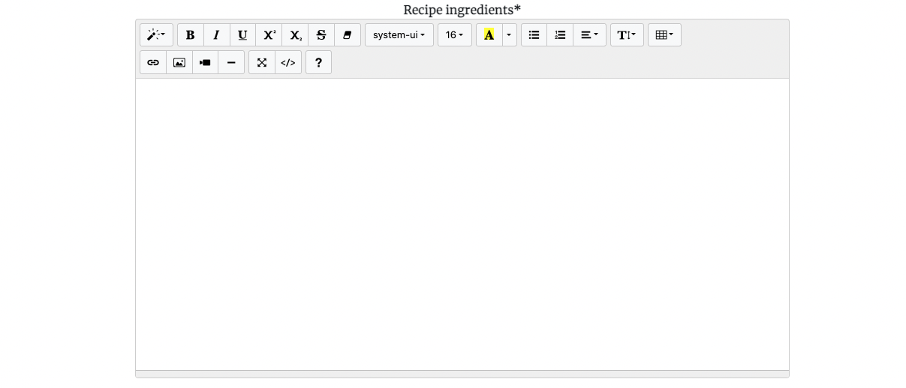
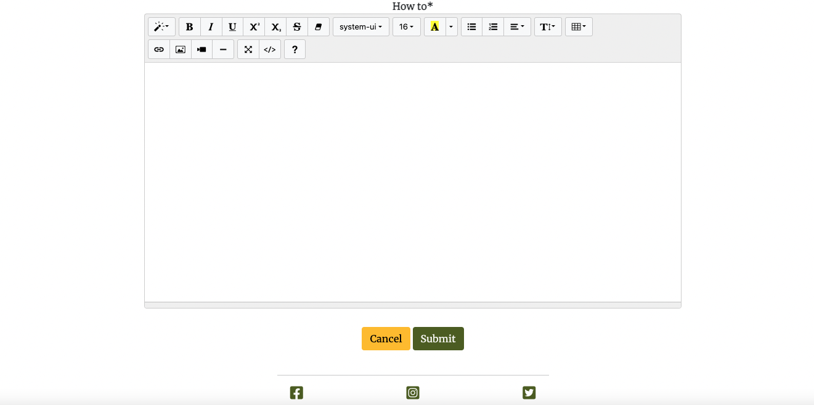

# Tastebook

[Live Site](https://8000-malinpalo-tastebook-w4zdo3wqn0p.ws-eu94.gitpod.io/) 

## Table Of Contents:
1. [Project Goals](#project-goals)
    * [CRUD functionality](#crud-functionality)
2. [UX Design](#ux-design)
    * [User Stories](#user-stories)
    * [Wireframes](#wireframes)
    * [Agile Methodology](#agile-methodology)
    * [Typography](#typography)
    * [Colour Scheme](#colour-scheme)
    * [Database Diagram](#database-diagram)    
3. [Features](#features)
    * [Navigation Bar](#navigation-bar)
    * [footer](#footer)
    * [Home Page](#home-page)
    * [Recipes Page](#recipes-page)
    * [Recipe Details](#recipe-details)
    * [Add Recipe Page](#add-recipe-page)
    * [Edit Recipe Page](#edit-recipe-page)
    * [Delete Recipe Page](#delete-recipe)
    * [Edit Comment Page](#edit-comment-page)
    * [Register Page](#register-page)
    * [Login Page](#login-page)
    * [Logout Page](#logout-page)

4. [Future Features](#future-features)
5. [Technologies Used](#technologies-used)
6. [Testing](#testing)
7. [Deployment](#deployment)
8. [Credits](#credits)
9. [Acknowledgements](#acknowledgements)

## Project Goals
Tastebook is a website built using the Django Full Stack framework for my Portfolio Project 4. Tastebook allows users to view and share their favourite recipes of food and drinks. Users are able to comment underneath recipes and like them. Users can also delete and edit their own recipes and comments. Users need to be logged in to get the full functionality of the site.

[Back to top](<#table-of-contents>)

### CRUD functionality

Tastebook features a data store with full Create, Read, Update and Delete functionality.

- Create - users can create a user account, and authenticated users can create a profile.
- Read - users can view the profiles and posts of other users. Authenticated users can read messages sent to them.
- Update - authenticated users can update their profiles and save the changes. 
- Delete - authenticated users can delete their profile and can also delete comments sent by or to them.

[Back to top](<#table-of-contents>)

## UX Design:

### Wireframes
Wireframes that where created in [Balsamiq](https://balsamiq.com/) for this project are displayed below. The wireframes were created in the planning phase of the project. Please note that the wireframes might not be exactly a copy of the project due to the fact that the site has changed during development.

### User Stories
After the first planning phase user stories were implemented one by one. The wireframes created became the base for the User stories. 

Individual user stories were categorised according to whether they had to be implemented to produce a Minimum Viable Product (MVP), with priority for development to be given to those that were part of the MVP specification. 

The user stories that where created can be found [here](https://github.com/users/malinpalo/projects/9).

### Agile Methodology
GitHub issues, milestones and projects were used to document and track an agile development approach.
An issue was created for each user story. These were labelled as 'MVP' if they were part of the MVP spec. All user stories were then added to a 'Product Backlog' milestone  [Link to product backlog](https://github.com/malinpalo/Tastebook/milestone/1).

I set up a plan for development this plan was just to show how it could work in real life. Development was divided into iterations with a timebox of four working days, each with a total value of 16 story points. The duration in calendar days was variable during development, due to fitting the four working days around work and other commitments. A milestone and a GitHub project board (a Kanban board) were created for each iteration, and user stories moved from the Product Backlog and into iterations as each cycle of work began. They were labelled as 'must have', 'could have' or 'should have' goals for the iteration, and assigned story point values. Story points for 'must have' user stories never exceeded 9 (60%).

A project Kanban board was used to track progress, with user stories moved between 'Todo', 'In Progress' and 'Done' columns as appropriate. 
[Kanban in progress](https://github.com/users/malinpalo/projects/24).

There was consideable uncertainty as to how many story point to allocate to each task. Therefor the first iteration had tasks exceeding 16 storie points in total. Tasks that didn't finish in time where to be moved in to the next iteration.

### Typography

- The font that was used for the logo and the heading on the homepage was **Delicious Handrawn**
- **Merriweather** font was used for the body.
- **Sanserif** was used as a fallback for the other fonts just in case they wouldn't load.

### Color Scheme

This is the color scheme that I decided to work with. 

I used [Coolors](https://coolors.co/) to generate a color scheme from the default post image. I chose a natural background color with complimentary colors in green, blue and orange for text, buttons and icons to make the sites content stand out to be clear to the user.

### Database Diagram

I created an entity relationship diagram using LucidCharts.

[Back to top](<#table-of-contents>)

## Features:

### Navigation Bar

- The Navigation bar sits at the very top of each page, The logo is at the right hand side and the navigation links are on the left.
- When logged in the **Login** becomes **Logout** and the **Registeration** link is removed.
- The Navbar background is green with the Navigation links and logo in white colored text.
- When the logo is clicked it redirects the user to the home page.
- On large to xx-large screens the navigation bar is in the center of the page.
- When on medium to small screens the navigation menu changes to burger menu which shows all the nav links when clicked on (second two screenshot below).

Navigation bar on mobile and tablets

### Footer

- The footer is found at the bottom of every page and is responsive for small and large screens.
- The footer displays icons for Facebook, Instagram and Twitter. These are all green in colour to match the sites colour scheme.
- Above the icons there is a horizontal line that is centered.
- When any of the icons are clicked the social media site opens on a seperate tab, this way the user still has the Tastebook website open so they can easily navigate back to it.

### Home Page

- The home page has a background image of food on a table with a blank menu paper in white and has a light black linear gradiant to darken the image a bit and bring up the text color.
- In the center there is a heading that says **Tastebook** in blue with a shaded orange background.
- Below the heading there is a text box with information about the site, the text box has a blue border and white text which really makes the content stand out.

### Recipes Page

- At the top of the recipes page, right below the Nav bar there is a heading that says **The Recipes** which is underlined and centered.
- Below the header sits the recipe cards. A maximum of six cards can be displayed on each page.
- The **Read more** button is greyed out when the user is logged out and is green when the user is logged in.
- Above the recipes, on the left hand side there is a green **Add Recipe** button, this button is only displayed if the user is logged in.
- Below the recipe cards there will be a next and back button depending on how many recipes that have been added.

Recipe page logged out users.

Recipe page logged in users.

Next and Bback buttons

### Recipe Details

- At the top of the of the recipe details page in the center is the photo of the recipe.
- If the user who posted the recipe is viewing it, then the delete and edit buttons are visible at the top right.
- Below the image is the title of the recipe and the author who has posted it.
- Below the image to the left you have a like button that shows how many people liked the recipe, the heart will be an empty outline with a 0 next to it if no one has liked it, and it will be filled red if liked.
- Underneath the like button you have headings with **Recipe-description**, **Recipe-ingredients** and **How to** fields.
- In the end of the page is the comment section which has a heading that says **Comments**. The comment section has a border around it, and comments have a light grey backgound colour, which makes them stand out. The authors name and date is displayed below the comment and there is an edit and delete button in the top right of the comment which is only visible to the author of the comment.
- Below Comments is the **Add a Comment** section which has a border around it. Inside the section is the **Share your thoughts** text area where the user can enter their comment. To add a comment the user clicks a green **Add a comment** button.

### Add Recipe Page

- When a user clicks the **Add Recipe** button on the **The Recipes** page they are taken to the **Add Recipe page** where they are greeted with a form to enter their recipe.
- At the top there is a heading that says **Here you can add your recipe** with the form fields beneath it. I kept the form big and simple, so that it is easy for the user to use.
- For the **Recipe description**, **Recipe Ingredients** and **How to** fields the summernote widget is used so that a user can easily format their text, and style it whatever way they wish.
- Below this is a green **Submit** button. Once the button is clicked the recipe will be submitted and the user returned to the recipe page where they will see their recipe as the first one in the list.
- Beside the **Submit** button there is a yellow **Cancel** button. Once the button is clicked it will redirect the user back to the recipe page.

### Edit Recipe Page

- The **Edit Recipe** page is accessed when the user clicks the edit recipe pencil icon on the recipe details page.
- This is almost the same as the **Add Recipe** page. The only difference is that the form is already filled in with the details you entered before so that you can change them, and also the heading says **Edit Your Recipe**
- After editing the Recipe a success message will be displayed at the top of the screen.
- Please note that only the user who created the recipe can edit it from here.

### Delete Recipe Page

- When a user clicks on the delete icon on the recipe details page a bootstrap modal pops up in the center and asks the user to confirm.
- The modal is a square box with a grey background, with a heading that says **Delete Recipe** and a text that asks **Please, confirm that you want to delete the recipe**.
- At the bottom right of the modal box is a red **YES** button to confim if they want to delete it. Once clicked the recipe will be deleted and the user will be redirected to the recipes page.
- Beside the **YES** button there is a **CANCEL** button, that when clicked will make the modal disappear. There is also an **X** in the top right of the modal that also will make the modal disappear.
- Please note that only the user who created the recipe can delete it from here.
- After deleting the Recipe a success message will be displayed at the top of the screen.

### Edit Comment Page

- When the edit comment icon is clicked at the right of the comment, the user is brought to the edit comment page.
- This is just a bigger version of the **Add a Comment** section on the recipe details page, but it has the comment message you posted in the **Share your thoughts** box for you to edit.
- Above this there is a heading that tells you to **Edit your comment that you posted on**
- There is an green **Update** button below the text box. Once the button is clicked it will update the comment and bring you back to the recipe details page where you can view your updated comment.
- Beside the Update button there is an yellow **Cancel** button that redirects the user to the recipe details page, if they decide not to update the comment.
- Please note that only the user who created the comment can edit it from here.
- After editing the Comment a success message will be displayed at the top of the screen.

### Register Page

- The **Register** page has grey banner running accross the page. In the center of the Banner is a green heading saying **SIGN UP**.
Beneath the heading there is a text saying **Already have an account? Then please Sign In**. "Sign In" is a clickable link that the redirects the user to the Sign In page.
- Beneath this is a centered form so that the user can enter a **Username**, a **Email** which is optional and then enter the **Password** which they will have to confirm by entering it again.
- At the bottom of the form there is a green **SIGN UP** button.
- When the user fills out the form and clicks the **SIGN UP** button they will be logged in and redirected to the home page.

### Login Page

- The **login** page is similar to the register page as it has a grey banner running accross the page. In the center of the banner is a green heading saying **SIGN IN**. Beneath the heading there is a text saying **If you don't have an account, then click here to Sign Up first.** "Sign Up" is a clickable link that the redirects the user to the register page.
- Below the banner is the login form with the **Username** and **Password** fields and a **Remember Me** checkbox. At the bottom of the form is a green **SIGN IN** button that once clicked, it signs the user in and redirects them to the home page.

### Logout Page

- The **logout** page follows the same style as the regiser and login pages with a grey banner accross the screen. It has a green heading that says **SIGN OUT**. Beneath the heading there is a text asking the user **Are you sure you want to sign-out?**. Below this is a green **SIGN OUT** button. Once clicked the button signs the user out and redirects them to the **SIGN IN** page.

[Back to top](<#table-of-contents>)

## Future Features

- I would like to enable for users to create a profile section where they can add an photo and information about theme selves.  

[Back to top](<#table-of-contents>)

## Testing

Please click [**_here_**](TESTING.md) to read more information about testing Tastebook.

[Back to top](<#table-of-contents>)

## Technologies 

* [GitHub](https://github.com/) - to host the repositories.
* [Gitpod](https://www.gitpod.io/) - as the IDE for the application.
* [Heroku](https://en.wikipedia.org/wiki/Heroku) - is used to host this site.
* [Elephantsql](https://www.elephantsql.com/) - to store the database.
* [Cloudinary](https://cloudinary.com/) - was used to store the images.
* [Python](https://docs.python.org/3/contents.html) - primary language of the application.
* [HTML](https://www.w3schools.com/html/) - structure/skeleton of the page
* [CSS](https://www.w3schools.com/css/) - extra styling of the webpage
* [Javascript](https://www.w3schools.com/js/) - the apply some extra button functions that I wanted
* [Django](https://www.djangoproject.com/) - was the framework that was used.
* [Python](https://en.wikipedia.org/wiki/Python_(programming_language)) - django is a python framework.
* [Bootstrap 5](https://www.w3schools.com/bootstrap5/bootstrap_get_started.php) - for design and placement
* [PEP8](http://pep8online.com/) - for testing and validating the code.
* [Lighthouse](https://developer.chrome.com/docs/lighthouse/overview/) - Used to test site performance.
* [Google Chrome DevTools](https://developer.chrome.com/docs/devtools/) - Used to debug and test responsiveness.
* [Responsive Design Checker](https://www.responsivedesignchecker.com/) - Used for responsiveness check across devices.
* [Am I responsive](https://ui.dev/amiresponsive) - Used for responsiveness check across devices.
* [Favicon](https://favicon.io/) - Used to create the favicon.
* [Google Fonts](https://fonts.google.com/about) - for the font of the text
* [Balsamiq](https://en.wikipedia.org/wiki/Balsamiq) - was used to create the wireframes.
* [LucidChart](https://www.lucidchart.com/pages/) - was used to design the database schema.

[Back to top](<#table-of-contents>)
 

## Deployment
This website is deployed to Heroku from a github repository, the following steps were taken:

#### Creating Respository on Github
- First make sure you are signed into [Github](https://github.com/) and go to code institutes template, which can be found [here](https://github.com/Code-Institute-Org/gitpod-full-template).
- Then click on **use this template** and select **Create a new repository** from the drop down. Enter the name for the repository and click **Create repository from template**.
- Once the repository was created, I clicked the green **gitpod** button to create a workspace in gitpod so that I could write the code for the site.

#### Creating app on Heroku
- After creating the repository on github, head over to [heroku](https://www.heroku.com/) and sign in.
- On the home page, click **New** and **Create new app** from the drop down.
- Give the app a name(this must be unique) and select a **region** I chose **Europe** as I am in Europe, Then click **Create app**.

#### Create a database On ElephantSQL
- Log into the [ElephantSQL](https://www.elephantsql.com/) website and click **Create new Instance**
- Enter a **Name** and keep the plan as **Tiny Turtle Free**, then **tags** field can be left blank, Select a region closest to you, I selected **EU-West-1(Ireland)** as I'm in Sweden. Then click **Review** and afterwards click **create instance**.
- On The Dashboard click on your database instance name.
- You will see the details for your database instance, in the url section click on the copy icon to copy the database url.
- Head over to gitpod and create a **Database URL** enviroment variable in your env.py file and set it equal to the copied url.

#### Deploying to Heroku.
- Head back over to [heroku](https://www.heroku.com/) and click on your **app** and then go to the **Settings tab**
- On the **settings page** scroll down to the **config vars** section and enter the **DATABASE_URL** which you will set equal to the elephantSQL url, create **Secret key** this can be anything,
**CLOUDINARY_URL** this will be set to your cloudinary url and finally **Port** which will be set to 8000.
- Then scroll to the top and go to the **deploy tab** and go down to the **Deployment method** section and select **Github** and then sign into your account.
- Below that in the **search for a repository to connect to** search box enter the name of your repository that you created on **github** and click **connect**
- Once it has connected scroll down to the **Manual Deploy** and click **Deploy branch** when it has deployed you will see a **view app** button below and this will bring you to your newly deployed app.
- Please note that when deploying manually you will have to deploy after each change you make to your repository.

[Back to top](<#table-of-contents>)

## Credits
- Code Institutes **I Think I Can Blog** walk through was a great help, I used It for inspiration.
- The Net Ninja's Django Tutorial on youtube is a great resource that helped me understand the Django framework, The youtube video series starts [here](https://www.youtube.com/watch?v=n-FTlQ7Djqc&list=PL4cUxeGkcC9ib4HsrXEYpQnTOTZE1x0uc&index=1).
- [Stack Overflow](https://stackoverflow.com/) Thanks for giving me great support during the project.
- [W3schools](https://www.w3schools.com/) a great place to find basic answers in programing.
- [Pexels](https://www.pexels.com/) all images were take from Pexels.

[Back to top](<#table-of-contents>)

## Acknowledgements
- This fictional site was created for Portfolio Project #4 (Full Stack Toolkit) - Diploma in Full Stack Software Development at the [Code Institute](https://www.codeinstitute.net). 
- I would like to thank everyone on the slack channels for answering my questions and concerns during this project and throughout the course. 
- I would like to thank Tutors at the Code Institute for all the help and my husband and cousin for standing by my side.

[Back to top](<#table-of-contents>)
