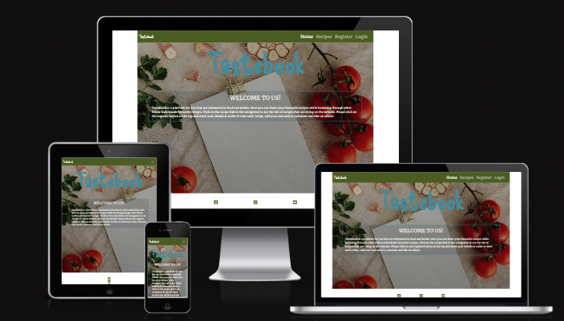
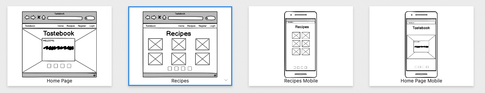

# Tastebook

[Live Site](https://8000-malinpalo-tastebook-w4zdo3wqn0p.ws-eu94.gitpod.io/) 

## Table Of Contents:
1. [Project Goals](#project-goals)
2. [UX Design](#ux-design)
    * [User Stories](#user-stories)
    * [Wireframes](#wireframes)
    * [Agile Methodology](#agile-methodology)
    * [Typography](#typography)
    * [Colour Scheme](#colour-scheme)
    * [Database Diagram](#database-diagram)
    
3. [Features](#features)
    * [Navigation](#Navigation-bar)
    * [footer](#footer)
    * [Home Page](#home-page)
    * [Recipes Page](#recipes-page)
    * [Recipe Details](#recipe-details)
    * [Add Recipe Page](#add-recipe-page)
    * [Edit Recipe Page](#edit-recipe-page)
    * [Delete Recipe Page](#delete-recipe)
    * [Edit Comment Page](#edit-comment-page)
    * [Register Page](#register-page)
    * [Login Page](#login-page)
    * [Logout Page](#logout-page)

4. [Future Features](#future-features)
5. [Technologies Used](#technologies-used)
6. [Testing](#testing)
7. [Deployment](#deployment)
8. [Credits](#credits)
9. [Acknowledgements](#acknowledgements)

## Project Goals
Tastebook is a website built using the Django Full Stack framework for my Portfolio Project 4. Tastebook allows users to view and share their favourite recipes of food and drinks. Users are able to comment underneath recipes and like them. Users can also delete and edit their own recipes and comments. Users need to be logged in to get the full functionality of the site.

## UX Design:

### User Stories
The user stories that where used can be found [here](https://github.com/malinpalo/Tastebook/issues) and are added below.

**Epic | Website Navigation**

**Epic | Crud Functionality**

**Epic | Administration**

**Epic | Register / Sign in and out**

### Wireframes
Wireframes that where created in Balsamiq for this project are displayed below. Please note that the wireframes might not be exactly a copy of the project due to the fact that the site has changed during development.

## Testing

### Lighthouse

* This is the read from lighthouse:

### Validator testing

* I tested it through the python validator and no errors were shown. Everything works perfectly. 
*  All the code has been run through the W3C html validator, the W3C CSS validator and the JavaScript JSHint validator. The code passed the W3C Validator barring all the django template tags. No errors where found.

* All code passed through the pep8-validator came out clean, looking like this:

## Technologies 

* [GitHub](https://github.com/) - to host the repositories.
* [Gitpod](https://www.gitpod.io/) - as the IDE for the application.
* [Elephantsql](https://www.elephantsql.com/) - for the postgresql
* [Python](https://docs.python.org/3/contents.html) - primary language of the application.
* [HTML](https://www.w3schools.com/html/) - Structure/skeleton of the page
* [CSS](https://www.w3schools.com/css/) - extra styling of the webpage
* [Javascript](https://www.w3schools.com/js/) - the apply some extra button functions that I wanted
* [Stack overflow](https://stackoverflow.com/) - basic explaining 
* [Bootstrap 5](https://www.w3schools.com/bootstrap5/bootstrap_get_started.php) - for design and placement
* [PEP8](http://pep8online.com/) - for testing and validating the code.
* [Google Fonts](https://fonts.google.com/about) - for the font of the text