# Tastebook

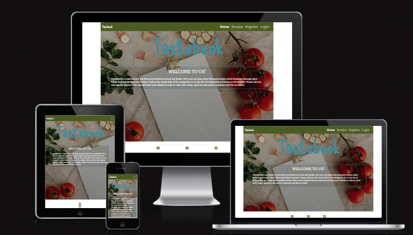

[Live Site](https://8000-malinpalo-tastebook-w4zdo3wqn0p.ws-eu94.gitpod.io/) 

## Table Of Contents:
1. [Project Goals](#project-goals)
    * [CRUD functionality](#crud-functionality)
2. [UX Design](#ux-design)
    * [User Stories](#user-stories)
    * [Wireframes](#wireframes)
    * [Agile Methodology](#agile-methodology)
    * [Typography](#typography)
    * [Colour Scheme](#colour-scheme)
    * [Database Diagram](#database-diagram)    
3. [Features](#features)
    * [Navigation Bar](#navigation-bar)
    * [footer](#footer)
    * [Home Page](#home-page)
    * [Recipes Page](#recipes-page)
    * [Recipe Details](#recipe-details)
    * [Add Recipe Page](#add-recipe-page)
    * [Edit Recipe Page](#edit-recipe-page)
    * [Delete Recipe Page](#delete-recipe)
    * [Edit Comment Page](#edit-comment-page)
    * [Register Page](#register-page)
    * [Login Page](#login-page)
    * [Logout Page](#logout-page)

4. [Future Features](#future-features)
5. [Technologies Used](#technologies-used)
6. [Testing](#testing)
7. [Deployment](#deployment)
8. [Credits](#credits)
9. [Acknowledgements](#acknowledgements)

## Project Goals
Tastebook is a website built using the Django Full Stack framework for my Portfolio Project 4. Tastebook allows users to view and share their favourite recipes of food and drinks. Users are able to comment underneath recipes and like them. Users can also delete and edit their own recipes and comments. Users need to be logged in to get the full functionality of the site.

### CRUD functionality

Tastebook features a data store with full Create, Read, Update and Delete functionality.

- Create - users can create a user account, and authenticated users can create a profile, collaboration requests and messages to their approved collaborators.
- Read - users can view the profiles and posts of other users. Authenticated users can read messages sent to them.
- Update - authenticated users can update their profiles and save the changes. They can approve collaboration requests sent to them wich results in a new many-to-many relationship in the database.
- Delete - authenticated users can delete their profile and pending collaboration requests, chosing to cancelling, rejecting or approving them. Authenticated users can also delete messages sent by or to them, the message is not deleted from the database until both the sending and receiving users have marked them as deleted.

## UX Design:

### Wireframes
Wireframes that where created in [Balsamiq](https://balsamiq.com/) for this project are displayed below. The wireframes were  created in the planning phase of the project. Please note that the wireframes might not be exactly a copy of the project due to the fact that the site has changed during development.

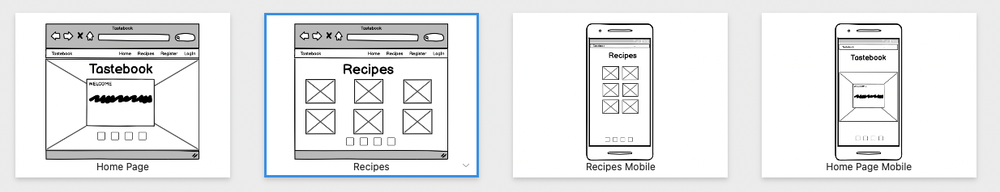

### User Stories
After the first planning phase user stories were implemented one by one. The wireframes created became the base for the User stories. 

Individual user stories were categorised according to whether they had to be implemented to produce a Minimum Viable Product (MVP), with priority for development to be given to those that were part of the MVP specification. 

The user stories that where created can be found [here](https://github.com/users/malinpalo/projects/9) and are added below.

### Agile Methodology
GitHub issues, milestones and projects were used to document and track an agile development approach.
An issue was created for each user story. These were labelled as 'MVP' if they were part of the MVP spec. All user stories were then added to a 'Product Backlog' milestone  [Link to product backlog](https://github.com/malinpalo/Tastebook/milestone/1).

I set up a plan for development this plan was just to show how it could work in real life. Development was divided into iterations with a timebox of four working days, each with a total value of 16 story points. The duration in calendar days was variable during development, due to fitting the four working days around work and other commitments. A milestone and a GitHub project board (a Kanban board) were created for each iteration, and user stories moved from the Product Backlog and into iterations as each cycle of work began. They were labelled as 'must have', 'could have' or 'should have' goals for the iteration, and assigned story point values. Story points for 'must have' user stories never exceeded 9 (60%).

A project Kanban board was used to track progress, with user stories moved between 'Todo', 'In Progress' and 'Done' columns as appropriate. 
[Kanban in progress](https://github.com/users/malinpalo/projects/24).

There was consideable uncertainty as to how many story point to allocate to each task. Therefor the first iteration had tasks exceeding 16 storie points in total. Tasks that didn't finish in time where to be moved in to the next iteration.

### Typography

### Color Scheme

This is the color scheme that I decided to work with. 
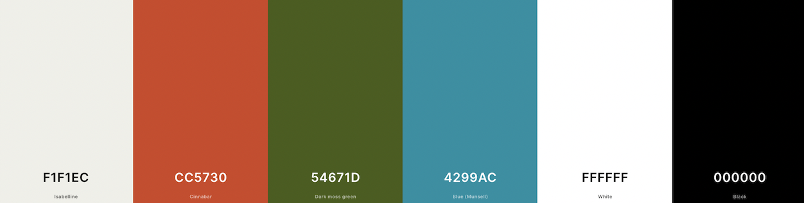

I used [Coolors](https://coolors.co/) to generate a color scheme from the default post image. I chose a natural background color with complimentary colors in green, blue and orange for text, buttons and icons to make the sites content stand out to be clear to the user.

### Database Diagram

I created an entity relationship diagram using LucidCharts.

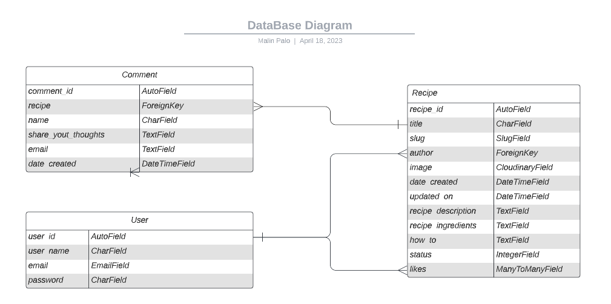

## Features:

### Navigation Bar

- The Navigation bar sits at the very top of each page, The logo is at the right hand side and the navigation links are on the left.
- When logged in the **Login** becomes **Logout** and the **Registeration** link is removed.
- The Navbar background is green with the Navigation links and logo in white colored text.
- When the logo is clicked it redirects the user to the home page.
- On large to xx-large screens the navigation bar is in the center of the page.
- When on medium to small screens the navigation menu changes to burger menu which shows all the nav links when clicked on (second two screenshot below).

Navigation bar on mobile and tablets

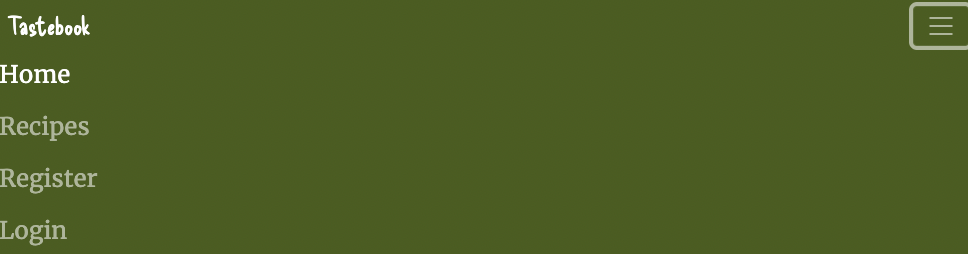

### Footer

- The footer is found at the bottom of every page and is responsive for small and large screens.
- The footer displays icons for Facebook, Instagram and Twitter. These are all green in colour to match the sites colour scheme.
- Above the icons there is a horizontal line that is centered.
- When any of the icons are clicked the social media site opens on a seperate tab, this way the user still has the Tastebook website open so they can easily navigate back to it.

### Home Page

- The home page has a background image of food on a table and has a light black linear gradiant to darken the image a bit and bring up the text color.
- In the center there is a heading that says **Tastebook** in blue with a shaded orange background.
- Below the heading there is a text box with information about the site, the text box has a blue border and white text which really makes the content stand out.

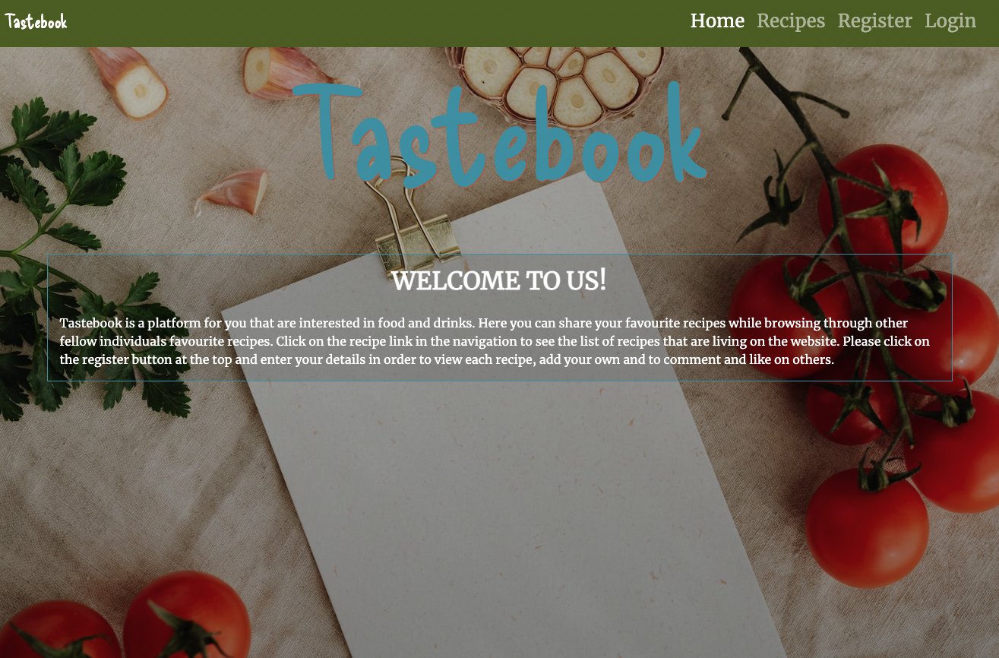

### Recipes Page

Recipe page logged out users.

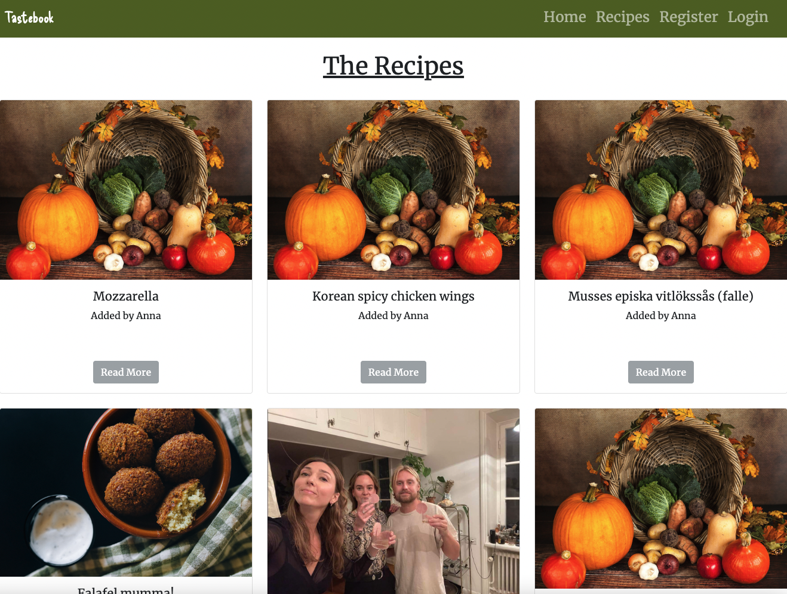

Recipe page logged in users.

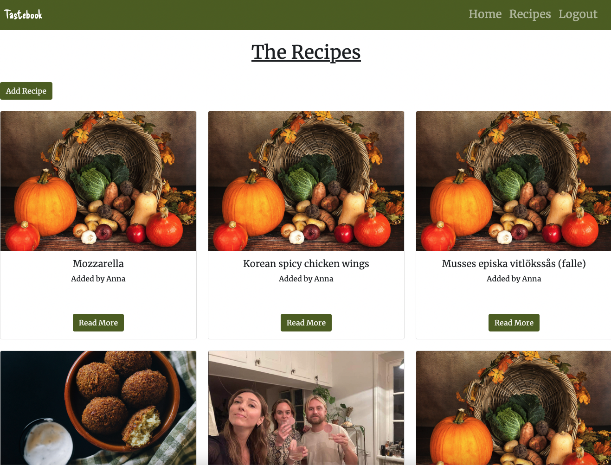

### Recipe Details

### Add Recipe Page

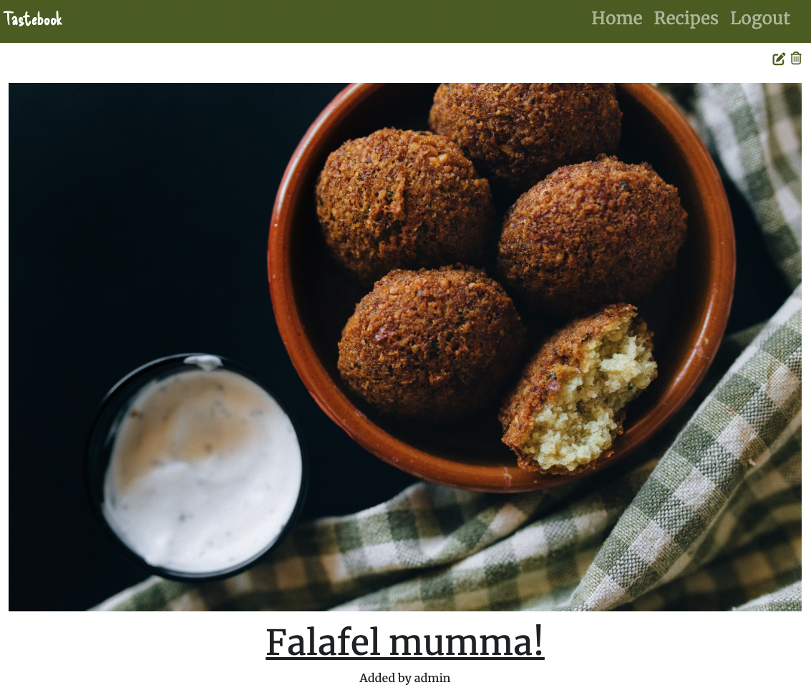
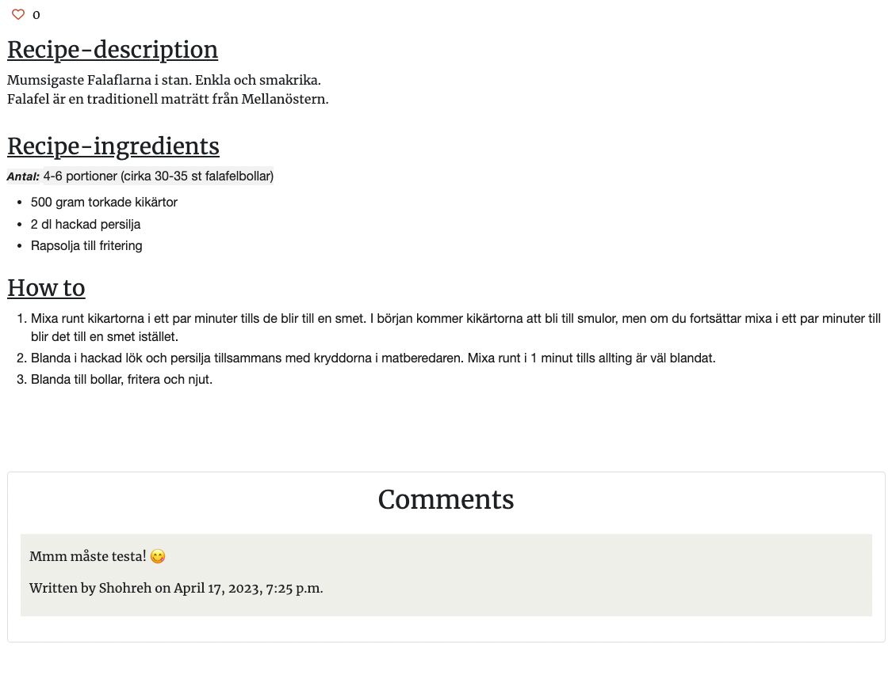
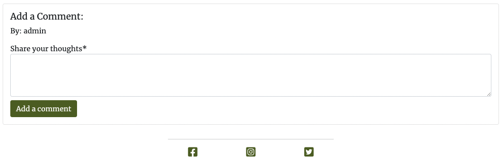

### Edit Recipe Page

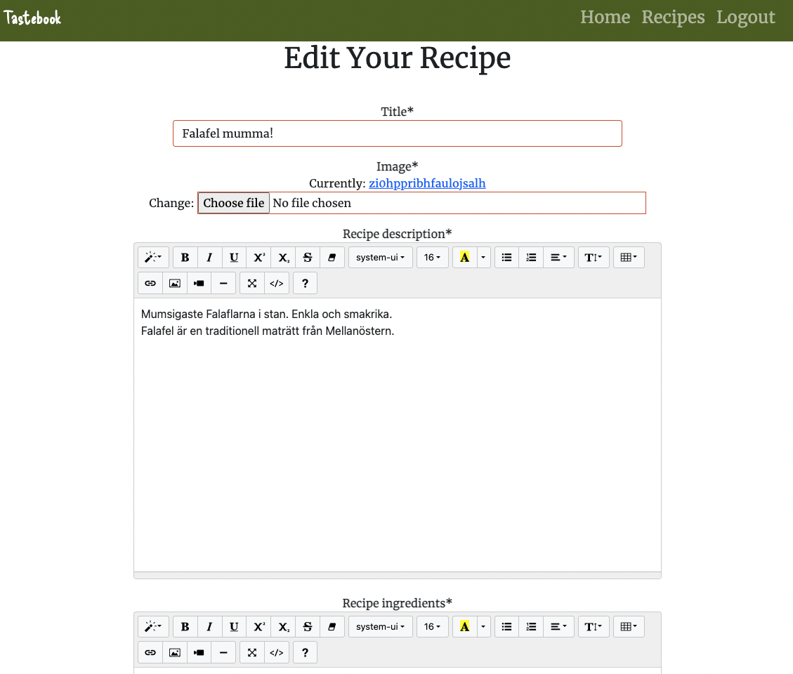
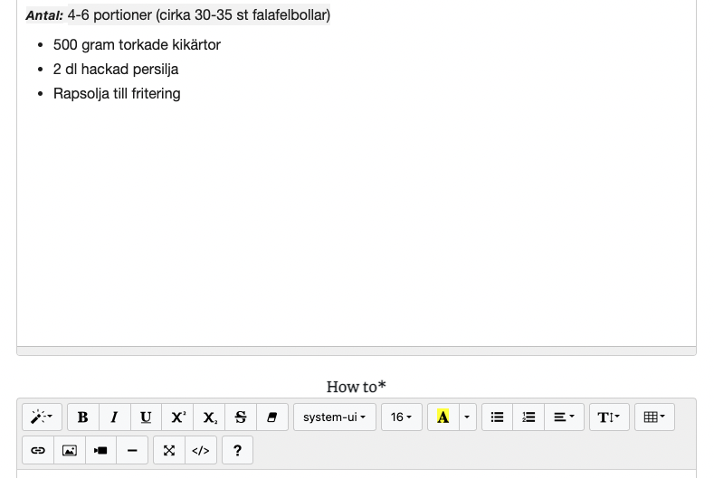
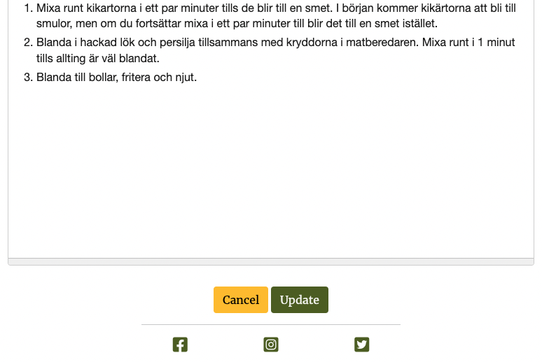

### Delete Recipe Page

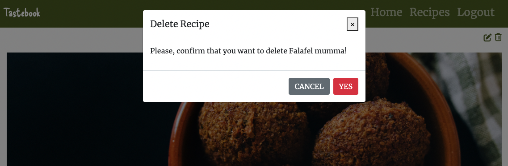

### Edit Comment Page

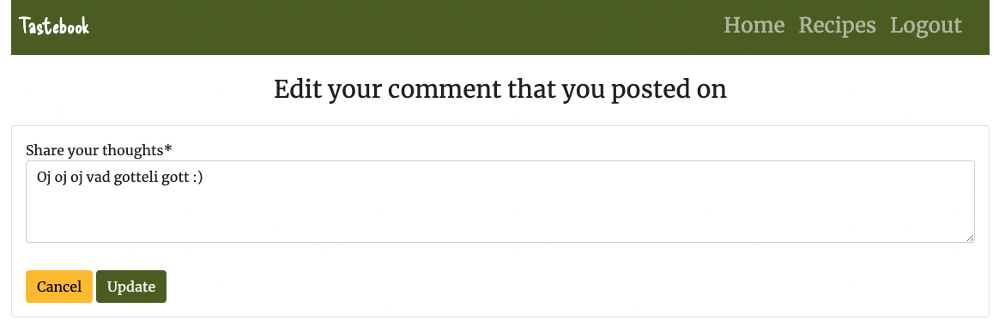

### Register Page

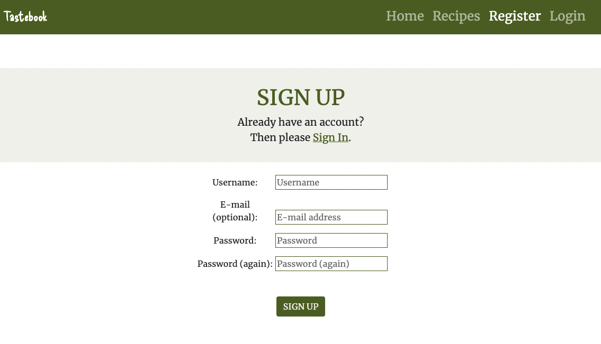

### Login Page

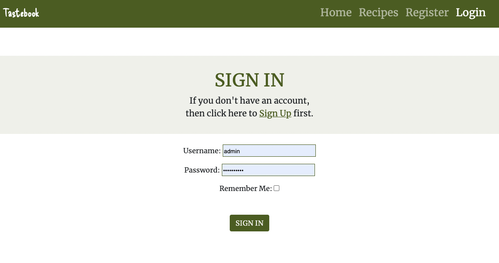

### Logout Page

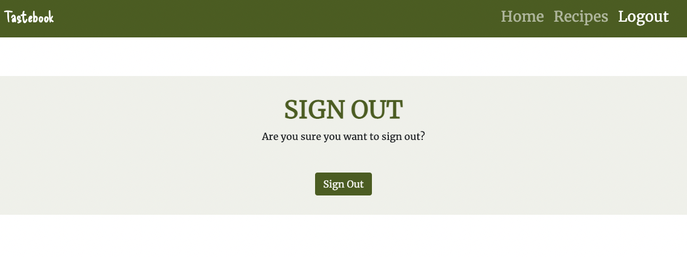

## Future Features

## Testing

Please click [**_here_**](TESTING.md) to read more information about testing Gro.

## Technologies 

* [GitHub](https://github.com/) - to host the repositories.
* [Gitpod](https://www.gitpod.io/) - as the IDE for the application.
* [Elephantsql](https://www.elephantsql.com/) - for the postgresql
* [Python](https://docs.python.org/3/contents.html) - primary language of the application.
* [HTML](https://www.w3schools.com/html/) - Structure/skeleton of the page
* [CSS](https://www.w3schools.com/css/) - extra styling of the webpage
* [Javascript](https://www.w3schools.com/js/) - the apply some extra button functions that I wanted
* [Stack overflow](https://stackoverflow.com/) - basic explaining 
* [Bootstrap 5](https://www.w3schools.com/bootstrap5/bootstrap_get_started.php) - for design and placement
* [PEP8](http://pep8online.com/) - for testing and validating the code.
* [Google Fonts](https://fonts.google.com/about) - for the font of the text