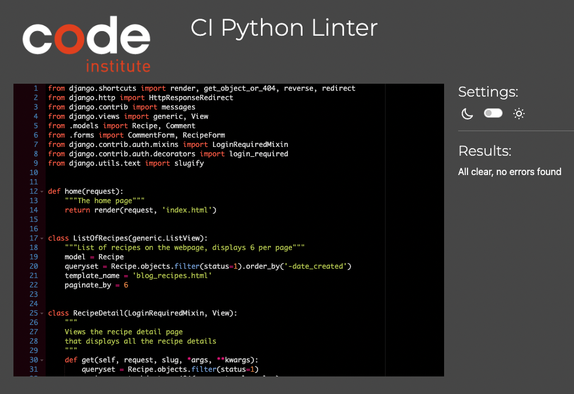
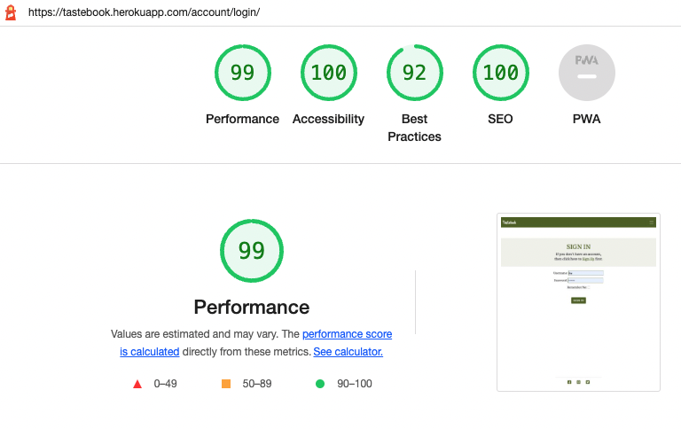
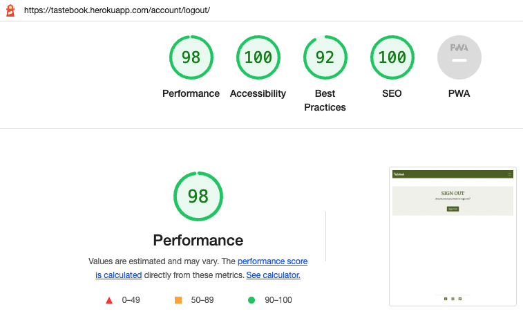

## Table Of Contents:
1. [Validator Testing](#vadilidator-testing)
    * [Html](#html)
    * [CSS](#css)
    * [JavaScript](#javascript)
    * [Python](#python)
    * [Lighthouse](#lighthouse)
2. [User Story Testing](#user-story-testing)
3. [Browser and Deivce Testing](#browser-and-device-testing)
4. [Manual Testing](#manual-testing)
5. [Bugs](#bugs)

## Validator Testing

### W3C HTML validator
The site pages were run through the [W3C validator](https://validator.w3.org/) to check for any issues and HTML syntax errors. 
Given the presence of Django template code in the HTML templates, the rendered HTML was copied from the Chrome browser by right clicking, selecting 'view page source' for each page of the site and then pasting directly into the HTML validator.
No errors or warnings were to be found.

### CSS
- The CSS stylesheet was put through the [W3C validator](https://jigsaw.w3.org/css-validator/)  to check for errors.
- No errors were to be found.

  

### JavaScript
- The Javascript file was put through the [Jshint](https://jshint.com/) to check for errors. 
- No errors were to be found.

### Python

### Python
- Issues with the custom python code were fixed on an ongoing basis during development using the pycodestyle tool, which was installed to the IDE, GitPod.  
- The code was also tested to check for errors using **Code Institutes pep8 online** website, [PEP8](https://pep8ci.herokuapp.com/). No errors returned as you can see from the screenshots below.

#### Blog App

    
admin.py
  
    
  

  

    
forms.py
  
    
  

  

    
models.py
  
    

  
  

    
urls.py
  
    

  

    
views.py
  
    

  

[Back to the top](#table-of-contents)
- - - 

### Lighthouse

Lighthouse in chrome dev tools was used to generate a report that tests the sites for **Performance**, **Accessibility**, **Best Practices** and **Seo**. 

    
Home
  
    

    
Recipes
  
    

    
Add Recipe
  
    

    
Register
  
    

    
Login
  
    

    
Logout
  
    

---
[Back to the top](#table-of-contents)

## User Story Testing
---
[Back to the top](#table-of-contents)

## Browser and Device Testing
---
[Back to the top](#table-of-contents)

