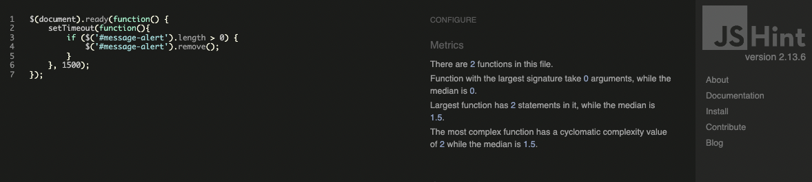
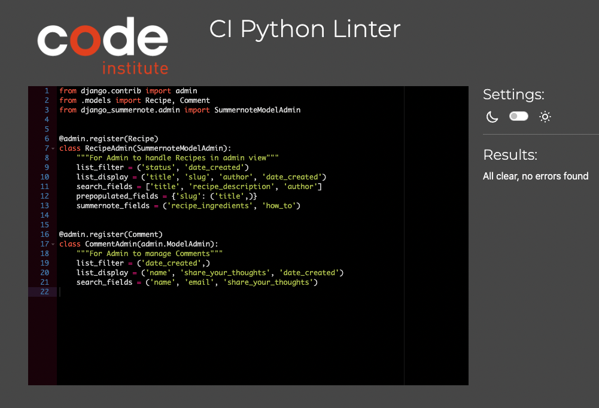

## Table Of Contents:
1. [Validator Testing](#vadilidator-testing)
    * [Html](#html)
    * [CSS](#css)
    * [JavaScript](#javascript)
    * [Python](#python)
    * [Lighthouse](#lighthouse)
2. [User Story Testing](#user-story-testing)
3. [Responsiveness Testing](#responsivness-testing)
4. [Manual Testing](#manual-testing)
5. [Bugs](#bugs)

## Validator Testing

### W3C HTML validator
The site pages were run through the [W3C validator](https://validator.w3.org/) to check for any issues and HTML syntax errors. 
Given the presence of Django template code in the HTML templates, the rendered HTML was copied from the Chrome browser by right clicking, selecting 'view page source' for each page of the site and then pasting directly into the HTML validator.
No errors or warnings were to be found.

### CSS
- The CSS stylesheet was put through the [W3C validator](https://jigsaw.w3.org/css-validator/)  to check for errors.
- No errors were to be found.

  

### JavaScript
- The Javascript file was put through the [Jshint](https://jshint.com/) to check for errors. 
- No errors were to be found.

### Python
- Issues with the custom python code were fixed on an ongoing basis during development using the pycodestyle tool, which was installed to the IDE, GitPod.  
- The code was also tested to check for errors using **Code Institutes pep8 online** website, [PEP8](https://pep8ci.herokuapp.com/). No errors returned as you can see from the screenshots below.

#### Blog App

    
admin.py
  
    
  

  

    
forms.py
  
    
  

  

    
models.py
  
    

  
  

    
urls.py
  
    

  

    
views.py
  
    

  

[Back to the top](#table-of-contents)
- - - 

### Lighthouse

Lighthouse in chrome dev tools was used to generate a report that tests the sites for **Performance**, **Accessibility**, **Best Practices** and **Seo**. 

    
Home
  
    

    
Recipes
  
    

    
Add Recipe
  
    

    
Register
  
    

    
Login
  
    

    
Logout
  
    

---
[Back to the top](#table-of-contents)

## User Story Testing
---
[Back to the top](#table-of-contents)

## User story testing

##### Navigation
*As a user I can use a navbar so that I can easily navigate on the website*
 - The Navigation at the top of the page is easy to navigate, when hovering a page in the navbar the page name gets highlighted wich helps the user to see wich page they are entering.

#### Register
*As a User I can create an account so that I can add my own recipes and comment on other users recipes*
 - In the Navigation bar at the top of the page, if a User clicks on the Register link, they will be brought to the registeration page wehere they can sign up, once they sign up they will be able to access full functionality of the site.
 
#### Signin | Signout
*As a User I can Sign-in/ Sign-out so that I can access features when signed in and signed out so that no one can access my account.*
 - When a User is not logged in the login link will be visible to the far right in the navigation bar, the same link will change to logut when the user is logged in.
 - When the User enters their login credentials they wil be able to access the full fuctionality of the site, when the user is logged out they will not have full access on the site and their account will be secure.

#### Homepage
*As a User I can be welcomed by a homepage so that I can get a clear picture of what the website is all about and how to use it*
 - On the home page is an 'Welcome to Us' section that cleary tells the user what the site is about and how to use it.

#### View Recipes
*As a User I can view the list of recipes so that I can choose one to read*
 - The user is able to click the recipes link in the nav bar and this will take them to the recipes page where they can view a list of recipes.
 - If they wish to view one recipe in full detail they can click Read More and they will then be able to see the recipe details. The user must be signed in to view the recipe details as if they are not signed in the Read More button will be disabled.

#### Add A Recipe
*As a User I can add a recipe so that other users can view it, like it and add comments to it.*
- When a user is signed in they are able to click on the Add Recipe button at the Recipes page, which will bring them to the Add Recipes page where they can upload their recipe.

#### Edit | Delete A recipe
*As a User I can Edit/Delete my recipes so that I can update my recipes after posting them to the website*
- When viewing a recipe that the User has uploaded in the top right corner they have a choice to either delete or edit the recipe. A user can only edit or delete a recipe they are the owner for.

#### Like | Unlike recipes
*As a User I can like/unlike recipes so that I can give other users feedback without writing a comment.*
- On the recipe details there is a like button below the image, it is a Love heart that is empty outline when not liked and then is filled when liked, beside it displays the number of people that like the recipe. A User must be logged in to access this functionality.

#### Add A Comment
*As a User I can comment on my own and other recipes so that I can provide feedback to other users*
- When a user is signed in and they are on the recipe details page for a particular recipe, at the bottom of the page there is a comment section where they can add a comment.

#### Edit | delete A comment
*As a User I can choose to edit/delete comments so that I can update my comments after posting them to the website*
- The User is able to edit or delete any comment that they have created by clicking on the edit or delete button in the right hand side of that comment.

## Responsiveness Testing

The responsive design tests were carried out manually throughout the build using Google Chrome Dev Tools. As this is primarily a browser based platform I based the main design around a desktop view, adding responsive design for tablet and mobile devices as well. 

During the testing process I also used the [Responsive Design Checker](https://www.responsivedesignchecker.com/) website to simulate the website on several other devices. Here is what I found:

### Mobile Devices

||
iPhone 6/6s/7

375 x 667
|
Samsung Galaxy S5/6/7

360 x 640
|
Google Pixel/Nexus 5

411 x 731
|
| :- | :-: | :-: | :-: |
|Render|Pass |Pass|Pass|
|Images|Pass|Pass|Pass|
|Links|Pass|Pass|Pass|

### Tablet Devices

||
Amazon Kindle Fire

768 x 1024
|
Samsung Galaxy Tab 10

800 x 1280
|
Apple iPad Pro

1366 x 1024

|
| :- | :-: | :-: | :-: |
|Render|Pass|Pass|Pass |
|Images|Pass|Pass|Pass|
|Links|Pass|Pass|Pass|

### Desktop Devices

||
24“ Desktop

1920 x 1200
|
19” Desktop

1440 x 900
|
10” Notebook

1024 x 600
|
| :- | :-: | :-: | :-: |
|Render|Pass|Pass|Pass|
|Images|Pass|Pass|Pass|
|Links|Pass|Pass|Pass|

### Browser Compatibility 

Happening was tested on the following browsers:

- Google Chrome
- Microsoft Edge
- Mozilla Firefox

Appearance and functionality appear to be consistent throughout all browsers. 
---
[Back to the top](#table-of-contents)

