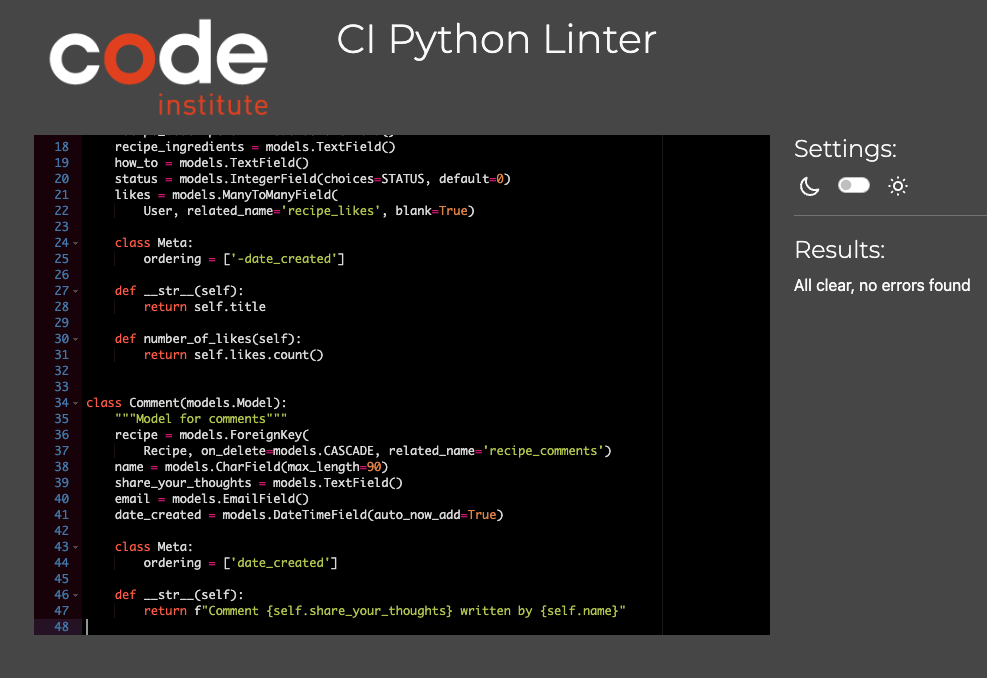

# **Gro**

# Frontend Testing

## Table Of Contents:
1. [Validator Testing](#vadilidator-testing)
    * [Html](#html)
    * [CSS](#css)
    * [JavaScript](#javascript)
    * [Python](#python)
    * [Lighthouse](#lighthouse)
2. [User Story Testing](#user-story-testing)
3. [Responsiveness Testing](#responsivness-testing)
4. [Browser Compatibility](#browser-compatibility)
4. [Manual Testing](#manual-testing)
5. [Bugs](#bugs)

## Validator Testing

### W3C HTML validator
The site pages were run through the [W3C validator](https://validator.w3.org/) to check for any issues and HTML syntax errors. 
Given the presence of Django template code in the HTML templates, the rendered HTML was copied from the Chrome browser by right clicking, selecting 'view page source' for each page of the site and then pasting directly into the HTML validator.
No errors or warnings were to be found.

### CSS
- The CSS stylesheet was put through the [W3C validator](https://jigsaw.w3.org/css-validator/)  to check for errors.
- No errors were to be found.

  

### JavaScript
- The Javascript file was put through the [Jshint](https://jshint.com/) to check for errors. 
- No errors were to be found.

### Python
- Issues with the custom python code were fixed on an ongoing basis during development using the pycodestyle tool, which was installed to the IDE, GitPod.  
- The code was also tested to check for errors using **Code Institutes pep8 online** website, [PEP8](https://pep8ci.herokuapp.com/). No errors returned as you can see from the screenshots below.

    
admin.py
  
    
  

  

    
forms.py
  
    
  

  

    
models.py
  
    

  
  

    
urls.py
  
    

  

    
views.py
  
    

  

[Back to the top](#table-of-contents)
- - - 

### Lighthouse

Lighthouse in chrome dev tools was used to generate a report that tests the sites for **Performance**, **Accessibility**, **Best Practices** and **Seo**. 

    
Home
  
    

    
Recipes
  
    

    
Add Recipe
  
    

    
Register
  
    

    
Login
  
    

    
Logout
  
    

---
[Back to the top](#table-of-contents)

## User Story Testing
---
[Back to the top](#table-of-contents)

## User story testing

##### Navigation
*As a user I can use a navbar so that I can easily navigate on the website*
 - The Navigation at the top of the page is easy to navigate, when hovering a page in the navbar the page name gets highlighted wich helps the user to see wich page they are entering.

#### Register
*As a User I can create an account so that I can add my own recipes and comment on other users recipes*
 - In the Navigation bar at the top of the page, if a User clicks on the Register link, they will be brought to the registeration page wehere they can sign up, once they sign up they will be able to access full functionality of the site.
 
#### Signin | Signout
*As a User I can Sign-in/ Sign-out so that I can access features when signed in and signed out so that no one can access my account.*
 - When a User is not logged in the login link will be visible to the far right in the navigation bar, the same link will change to logut when the user is logged in.
 - When the User enters their login credentials they wil be able to access the full fuctionality of the site, when the user is logged out they will not have full access on the site and their account will be secure.

#### Homepage
*As a User I can be welcomed by a homepage so that I can get a clear picture of what the website is all about and how to use it*
 - On the home page is an 'Welcome to Us' section that cleary tells the user what the site is about and how to use it.

#### View Recipes
*As a User I can view the list of recipes so that I can choose one to read*
- The user is able to click the recipes link in the nav bar and this will take them to the recipes page where they can view a list of recipes.
- If they wish to view one recipe in full detail they can click Read More and they will then be able to see the recipe details. The user must be signed in to view the recipe details as if they are not signed in the Read More button will be disabled.

#### Add A Recipe
*As a User I can add a recipe so that other users can view it, like it and add comments to it.*
- When a user is signed in they are able to click on the Add Recipe button at the Recipes page, which will bring them to the Add Recipes page where they can upload their recipe.

#### Edit | Delete A recipe
*As a User I can Edit/Delete my recipes so that I can update my recipes after posting them to the website*
- When viewing a recipe that the User has uploaded in the top right corner they have a choice to either delete or edit the recipe. A user can only edit or delete a recipe they are the owner for.

#### Like | Unlike recipes
*As a User I can like/unlike recipes so that I can give other users feedback without writing a comment.*
- On the recipe details there is a like button below the image, it is a Love heart that is empty outline when not liked and then is filled when liked, beside it displays the number of people that like the recipe. A User must be logged in to access this functionality.

#### Add A Comment
*As a User I can comment on my own and other recipes so that I can provide feedback to other users*
- When a user is signed in and they are on the recipe details page for a particular recipe, at the bottom of the page there is a comment section where they can add a comment.

#### Edit | delete A comment
*As a User I can choose to edit/delete comments so that I can update my comments after posting them to the website*
- The User is able to edit or delete any comment that they have created by clicking on the edit or delete button in the right hand side of that comment.

## Responsiveness Testing

The responsive design tests were carried out manually throughout the build using Google Chrome Dev Tools. As this is primarily a browser based platform I based the main design around a desktop view, adding responsive design for tablet and mobile devices as well. 

During the testing process I also used the [Responsive Design Checker](https://www.responsivedesignchecker.com/) website to simulate the website on several other devices. Here is what I found:

### Mobile Devices

||
iPhone 6/6s/7

375 x 667
|
Samsung Galaxy S5/6/7

360 x 640
|
Google Pixel/Nexus 5

411 x 731
|
| :- | :-: | :-: | :-: |
|Render|Pass |Pass|Pass|
|Images|Pass|Pass|Pass|
|Links|Pass|Pass|Pass|

### Tablet Devices

||
Amazon Kindle Fire

768 x 1024
|
Samsung Galaxy Tab 10

800 x 1280
|
Apple iPad Pro

1366 x 1024

|
| :- | :-: | :-: | :-: |
|Render|Pass|Pass|Pass |
|Images|Pass|Pass|Pass|
|Links|Pass|Pass|Pass|

### Desktop Devices

||
24“ Desktop

1920 x 1200
|
19” Desktop

1440 x 900
|
10” Notebook

1024 x 600
|
| :- | :-: | :-: | :-: |
|Render|Pass|Pass|Pass|
|Images|Pass|Pass|Pass|
|Links|Pass|Pass|Pass|

### Browser Compatibility 

Happening was tested on the following browsers:

- Google Chrome
- Microsoft Edge
- Mozilla Firefox

Appearance and functionality appear to be consistent throughout all browsers. 
---
[Back to the top](#table-of-contents)

## Manual Testing

#### Navigation
| Feature               | Test Performed                                                        | Result  |
|-----------------------|-----------------------------------------------------------------------|---------|
| Logo    | Clicking on the logo redirects the user to home page.                               | Pass    |
| Home    | Clicking on Home link brings user to the home page.                                 | Pass    |
| Recipes | Clicking on the recipes link, brings the user to the recipes page.                  | Pass    |
| Register | When signed out clicking on the Register link, brings the user to the              |         |
Registeration page.                                                                             | Pass    |
| Login | When signed out, clicking on the Login link, brings the user to the login page.       | Pass    |
| Logout | When signed in, clicking on the logout link, brings the user to the logout page.     | Pass    |
| Correct links display | When a user is signed in or out the correct links display for both.   | Pass    |
| Responsiveness | Checked to make sure it changes to burger menu on smaller devices.           | Pass    |

#### Footer
| Feature               | Test Performed                                                        | Result  |
|-----------------------|-----------------------------------------------------------------------|---------|
| External links | Clicking on social media links opens on a new page.                          | Pass    |
| Displays correctly on all pages | Made sure it displays correctly on all pages.               | Pass    |
| Responsiveness | Checked to make sure link icons display correctly on smaller devices.        | Pass    |

#### Home
| Feature               | Test Performed                                                        | Result    |
|-----------------------|--------------------------------------------------------------------|-----------|
| Responsiveness | The page is responsive on several different devices, browsers and screen widths. | Pass      |
| Background Image | Checked to make sure background image loads correctly.                  | Pass      |
| About Us Section | Make sure section displays correctly on all device widths               | Pass      |

#### Recipes
| Feature               | Test Performed                                                     | Result    |
|-----------------------|--------------------------------------------------------------------|-----------|
| Responsiveness | The page is responsive on several different devices, browsers and screen widths. | Pass      |
| Recipe cards   | Recipe cards displays as expected.                                        | Pass      |
| Read more button | Signed In users can click the read more button under each recipe.       | Pass      |
| Read more button | Signed Out users can't click the read more button under each recipe.    | Pass      |
| Add recipe Button | An Add Recipe button is being displayed when the user is signed in.   | Pass      |
| 6 Recipes Per Page | Not more than 6 recipes per page is being displayed.                  | Pass      |
| Next button | A next button at the bottom of the page is being displayed if there is more than six recipes being displayed.      | Pass      |
| Back button | A back button at the bottom of the page is being displayed if the user is on the next recipe page. | Pass      |

#### Recipe Details Page
| Feature               | Test Performed                                                     | Result    |
|-----------------------|--------------------------------------------------------------------|-----------|
| Responsiveness | The page is responsive on several different devices, browsers and screen widths. | Pass      |
| Recipe Content   | The recipe content displays as expected.                                | Pass      |
| Edit Recipe   | If the user is the owner of the recipe they can click the edit button to edit their recipe. | Pass      |
| Delete Recipe | If the user is the owner of the recipe they can click the delete button to delete their recipe. | Pass      |
| Signed in user access | Only singed in users can access the recipe details page.           | Pass      |
| Like button   | A clickable like button is being displayed below the recipe.               | Pass      |
| Display total number of likes   | Displays the number of users that have liked the recipe. | Pass      |
| Comment Section  | Displays comments added to the comment section.                         | Pass      |
| Post Comment   | Allows users to post a comment and display it in the comment section.     | Pass      |

#### Add A Recipe Page
| Feature               | Test Performed                                                     | Result    |
|-----------------------|--------------------------------------------------------------------|-----------|
| Responsiveness | The page is responsive on several different devices, browsers and screen widths. | Pass      |
| Display form  | Every input field is displaying on the add a crecipe form.                 | Pass      |
| Submit filled out form  | A user can fill out the form and click the submit button at the bottom of the page. | Pass      |
| Leave Image field blank on submission  | If the user leaves the image field blank the place holder image displays after submitting. | Pass      |
| Leave Input fields blank | The form wont submit if the user leaves required input fields blank, warnings will be displayed for the user. | Pass      |
| Submit Button | On click it will submit the recipe, and bring the user to the recipes page where the newly added recipe can be seen. | Pass      |
| Cancel Button | On click it will bring the user back to the recipes list.                  | Pass      |
| Success Message | Success message is displayed at the top of the screen when a user clicks Submit.  | Pass      |

#### Update A Recipe Page
| Feature               | Test Performed                                                     | Result    |
|-----------------------|--------------------------------------------------------------------|-----------|
| Responsiveness | The page is responsive on several different devices, browsers and screen widths. | Pass      |
| Display form  | All the input fields displays with the orginal recipe.                                  | Pass      |
| Update form  | When a user updates a recipe and clicks the submit button at the bottom of the page the recipe updates. | Pass      |
| Update Button | On click it updates the recipe, and brings the user to the recipes page where the updated recipe can be seen. | Pass      |
| Cancel Button | On click it brings the user back to the recipes list.                  | Pass      |
| Success Message | A success message is displayed at the top of the screen when a user clicks update.  | Pass      |

#### Delete A Recipe Modal
| Feature               | Test Performed                                                     | Result    |
|-----------------------|--------------------------------------------------------------------|-----------|
| Responsiveness | The page is responsive on several different devices, browsers and screen widths. | Pass      |
| Yes Button | When the user clicks the yes button the recipe will be deleted.                 | Pass      |
| Cancel Button | When the user clicks the cancel button, the delete modal will disappear and the user will be back on the recipe page.     | Pass      |
| Clicking Outside The Modal | When the user clicks anywhere ouside the modal the modal will disappear.    | Pass      |
| X  | When the user clicks on the X button at the top of the modal, the modal disappears.   | Pass      |
| Success Message | Success message is displayed at the top of the screen when a user clicks yes on the delete modal.  | Pass      |

#### Register Page
| Feature               | Test Performed                                                     | Result    |
|-----------------------|--------------------------------------------------------------------|-----------|
| Responsiveness | The page is responsive on several different devices, browsers and screen widths. | Pass      |
| Sign In link | Under the "already have an account section", the Sign in link redirects the user to the Login Page | Pass      |
| Submit Filled Out Form  | When the user fills out the sign up form and clicks the Signup button a new account is created. | Pass      |
| Leave Email Field Blank  | When the user fills out all the fields in the form except the optional email field and clicks submit a new account is created. | Pass      |
| Leave Username Field Blank| When the user fills out the form and leaves Username field blank, a warning messages appeare saying that the field most not be left blank, Sign Up is not approved.| Pass      |
| Leave Password Field Blank| When the user fills out the form and leaves Password field blank, a warning messages appeare saying that the field most not be left blank, Sign Up is not approved.| Pass      |
| Leave Password (again) Field Blank| When the user fills out the form and leaves Password (again) field blank, a warning messages appeare saying that the field most not be left blank, Sign Up is not approved.| Pass      |
| Signup with an already taken username| When the user register an account that already has the taken username, the sign upp fails and a warning messages appeare saying that a user with that username already exists. | Pass      |
| Signup Button | On click the signup button will submit the user details, log them in and redirect them to the home page. | Pass      |
| Success Message | Success message is displayed at the top of the screen when a user enters the correct details and clicks Sign Up. | Pass      |

#### Login Page
| Feature               | Test Performed                                                     | Result    |
|-----------------------|--------------------------------------------------------------------|-----------|
| Responsiveness | The page is responsive on several different devices, browsers and screen widths. | Pass      |
| Sign Up link | Under the "if you do not have an account" section, the Sign up link redirects the user to the Register Page        | Pass      |
| Leave Username Field Blank| When the user fills out the form and leaves Username field blank, a warning messages appeare saying that the field most not be left blank, Sign In is not approved.| Pass      |
| Leave Password Field Blank| When the user fills out the form and leaves Password field blank, a warning messages appeare saying that the field most not be left blank, Sign In is not approved.| Pass      |
| Sign In with unregistered account | If a User tries to sign in with an account that is not registered, a warning messages appeare saying that 'the username and/or password you specified are not correct'. The sig in will not be approved. | Pass      |
| Sign In Button | On click it will sign in the user if they have entered the right credentials. The user will get redirect to the home page. | Pass      |
| Success Message | Success message is displayed at the top of the screen when a user enters the correct credentials and clicks Sign in. | Pass      |

#### Logout Page
| Feature               | Test Performed                                                     | Result    |
|-----------------------|--------------------------------------------------------------------|-----------|
| Responsiveness | The page is responsive on several different devices, browsers and screen widths. | Pass      |
| Sign Out Button | When clicked it Signs out the user and redirect them to the login page.  | Pass      |
| Success Message | Success message is displayed at the top of the screen after clicking Sign Out to let the user know they have logged out. | Pass      |

---
[Back to the top](#table-of-contents)
